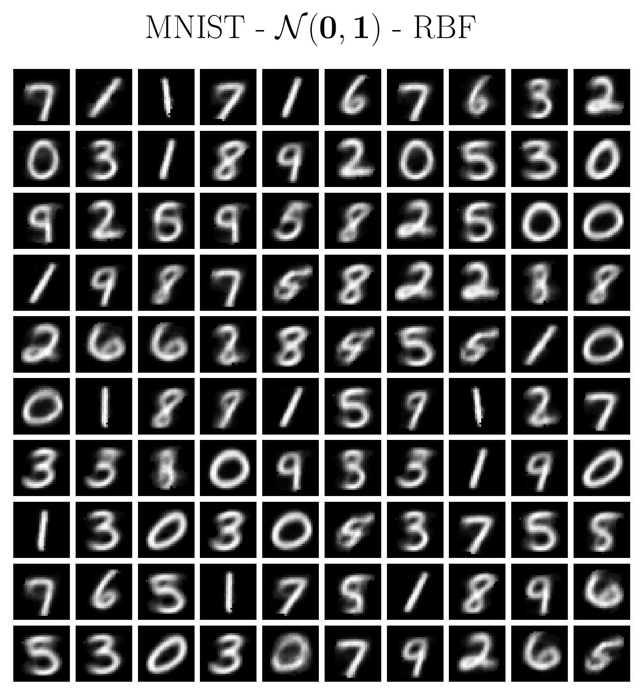
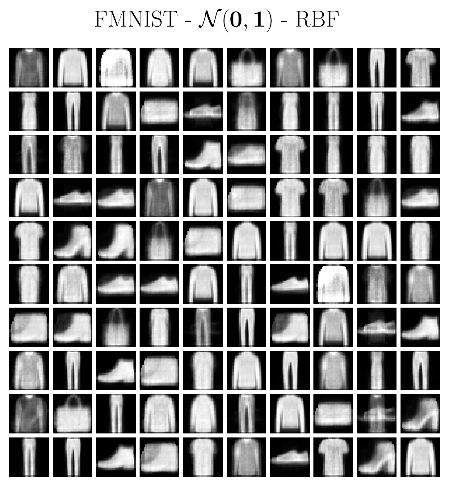
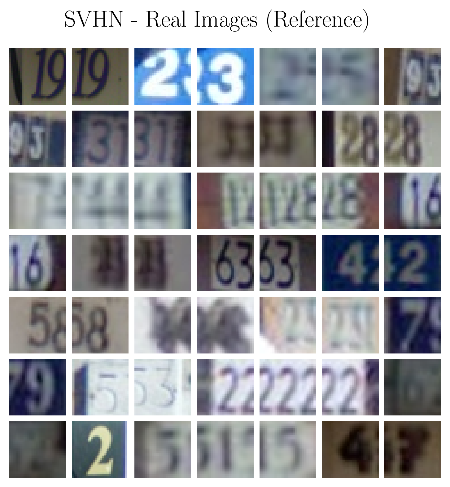
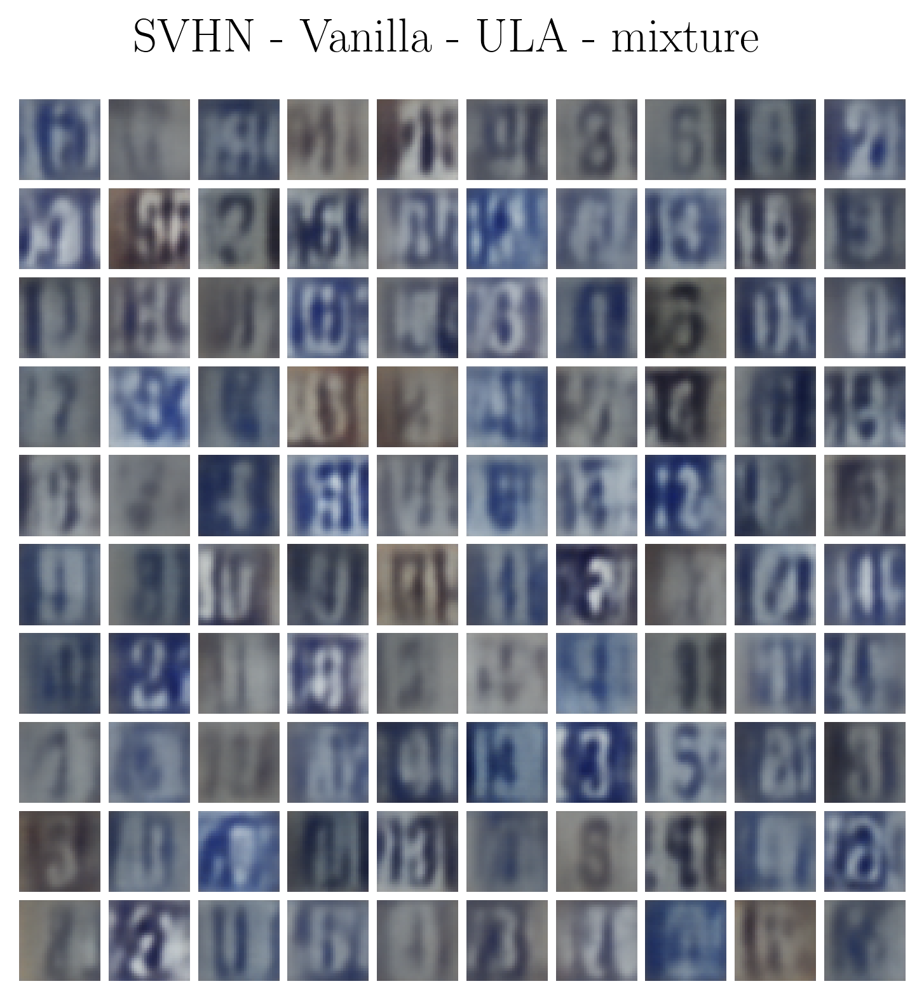
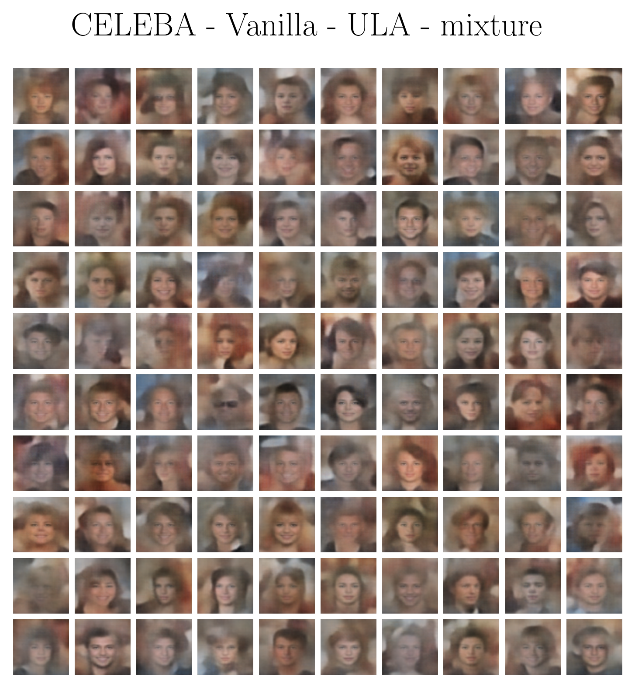
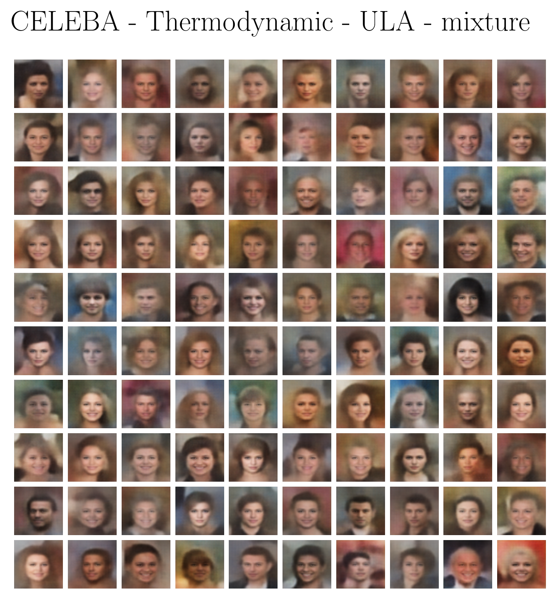
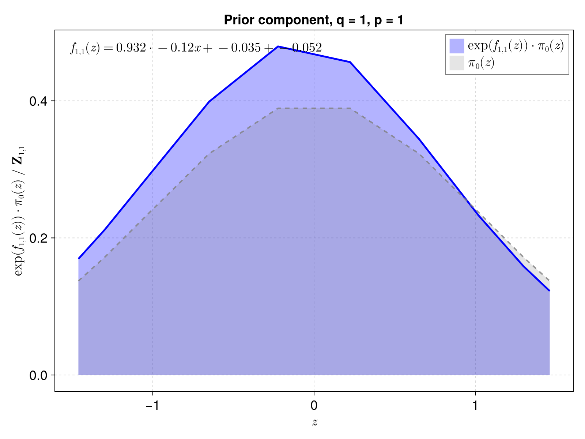

# KAEM 

KAEM is a generative model presented [here](https://www.arxiv.org/abs/2506.14167).

## Setup:

Need [Conda](https://docs.conda.io/projects/conda/en/latest/user-guide/install/index.html) and [Julia](https://github.com/JuliaLang/juliaup). Choose your favourite installer and run: 

```bash
bash <conda-installer-name>-latest-Linux-x86_64.sh
curl -fsSL https://install.julialang.org | sh
```

Then install

```bash
make install
```

[Optional;] Test all Julia scripts:

```bash
make test
```

### Note for windows users:

This repo uses shell scripts solely for convenience, you can run everything without them too. If you want to use the shell scripts, [WSL](https://learn.microsoft.com/en-us/windows/wsl/install) is recommended.

---

## Quick start:

List commands:
```
make help
```

Edit the config files:

```bash
nvim config/nist_config.ini
```

### Training modes

| Command | Description | Defaults |
|---------|-------------|----------|
| `make train DATASET=X MODE=Y` | Single KAEM job (tmux) | DATASET=MNIST, MODE=thermo |
| `make sequential CONFIG=jobs.txt` | Jobs from file, one at a time | CONFIG=jobs.txt |
| `make distributed DATASET=X MODE=Y DEVICE=N` | Single job on specific GPU | DEVICE=0 |
| `make batch CONFIG=jobs.txt` | Jobs from file, parallel across GPUs | NUM_DEVICES=auto |

Available KAEM modes: `vanilla`, `thermo`, `variational`

Shorthand targets:
```bash
make train-vanilla DATASET=MNIST
make train-thermo DATASET=SVHN
make train-variational DATASET=CIFAR10
```

### Baseline models

Train baseline generative models for comparison:

| Command | Description |
|---------|-------------|
| `make baseline MODEL=X DATASET=Y` | Train single baseline (tmux) |
| `make baseline-vae DATASET=CIFAR10` | Train VAE baseline |
| `make baseline-gan DATASET=CIFAR10` | Train GAN baseline |
| `make baseline-ddpm DATASET=CIFAR10` | Train DDPM baseline |
| `make baseline-pang DATASET=CIFAR10` | Train Pang EBM baseline |
| `make baseline-all DATASET=CIFAR10` | Train all baselines sequentially |

Available baseline models: `vae`, `gan`, `ddpm`, `pang`

### Job configuration

Create a `jobs.txt` file with KAEM and baseline jobs:
```
# KAEM jobs
MNIST thermo
CIFAR10 vanilla
SVHN variational

# Baseline jobs
CIFAR10 baseline-vae
CIFAR10 baseline-gan
CELEBA baseline-ddpm
```

Run sequentially on single device:
```bash
make sequential CONFIG=jobs.txt
```

Run in parallel across GPUs (one job per GPU):
```bash
make batch CONFIG=jobs.txt NUM_DEVICES=4
```

### Device configuration

Set device in config files (`config/*.ini`):
```ini
[TRAINING]
device = gpu   # Options: cpu, gpu, tpu
```

Available datasets: `MNIST`, `FMNIST`, `CIFAR10`, `SVHN`, `CELEBA`, `PTB`, `SMS_SPAM`, `DARCY_FLOW`

For benchmarking run:

```bash
make bench
```

---

## Julia flow:

With trainer (preferable):

```julia
using ConfParser, Random

include("src/pipeline/trainer.jl")
using .trainer

t = init_trainer(
      rng, 
      conf, # See config directory for examples
      dataset_name; 
      img_resize = (16,16), # Resize for prototyping
      file_loc = loc
)
train!(t)
```

Without trainer:

```julia
using Random, Lux, Enzyme, ComponentArrays, Accessors

include("src/KAEM/KAEM.jl")
include("src/KAEM/model_setup.jl")
include("src/utils.jl")
using .KAEM_model
using .ModelSetup
using .Utils

model = init_KAEM(
      dataset, 
      conf, 
      x_shape; 
      file_loc = file_loc, 
      rng = rng
)

# MLIR-compiled loss, (slow to compile, fast to run, see https://mlir.llvm.org/).
x, loader_state = iterate(model.train_loader)
x = pu(x)
model, ps, st_kan, st_lux, st_rng = prep_model(model, x, optimizer; rng = rng) 
loss, grads, st_ebm, st_gen = model.loss_fcn(
      ps,
      st_kan,
      st_lux,
      model,
      x,
      st_rng;
      train_idx = 1, # Only affects temperature scheduling in thermo model
)

# States reset with Accessors.jl:
@reset st.ebm = st_ebm
@reset st.gen = st_gen
```
---

## Samples

### Importance Sampling
> KAEM is a robust probabilistic model. It can even be trained cheaply with importance sampling.

<table>
  <tr>
    <td align="center"><br/><b>MNIST</b></td>
    <td align="center"><br/><b>Fashion-MNIST</b></td>
  </tr>
</table>

### Langevin Dynamics
> When importance sampling explodes with variance, unadjusted Langevin algorithm may be used.

<table>
  <tr>
    <td align="center"><br/><b>SVHN (real)</b></td>
    <td align="center"><br/><b>SVHN (generated)</b></td>
  </tr>
</table>

### Thermodynamic Integration
> Thermo training is presented as an embarrassingly parallel, interpretable, and structure-preserving alternative to diffusion EBMs for improved mixing in latent space.

<table>
  <tr>
    <td align="center"><br/><b>CelebA (vanilla)</b></td>
    <td align="center"><br/><b>CelebA (thermo)</b></td>
  </tr>
</table>

### WIP: Latent Discovery
> KAEM can be used to discover latent priors and algebraic structure in the latent space.

<table>
  <tr>
    <td align="center"><br/><b>Symbolic regression on untrained test prior.</b></td>
  </tr>
</table>


## Citation/license [](https://opensource.org/licenses/MIT)

```bibtex
@misc{raj2025kolmogorovarnoldenergymodelsfast,
      title={Kolmogorov-Arnold Energy Models: Fast and Interpretable Generative Modeling}, 
      author={Prithvi Raj},
      year={2025},
      eprint={2506.14167},
      archivePrefix={arXiv},
      primaryClass={cs.LG},
      url={https://arxiv.org/abs/2506.14167}, 
}
```
